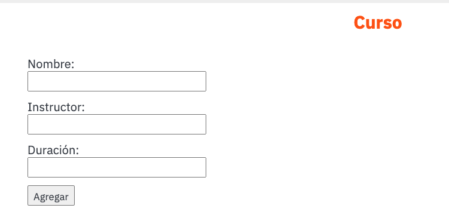
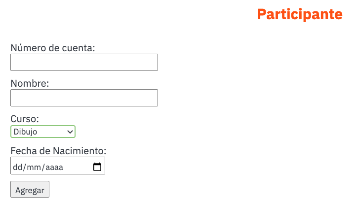
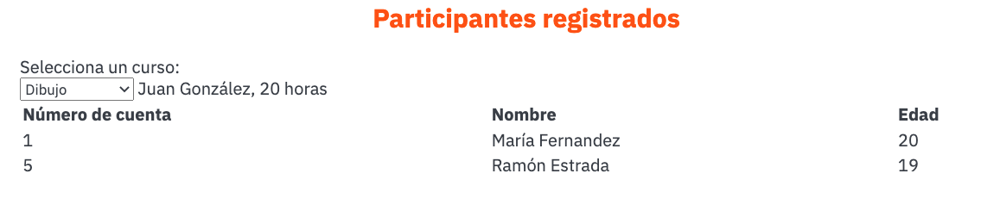

> Photo by <a href="https://unsplash.com/@timmossholder?utm_source=unsplash&utm_medium=referral&utm_content=creditCopyText">Tim Mossholder</a> on <a href="https://unsplash.com/s/photos/learning?utm_source=unsplash&utm_medium=referral&utm_content=creditCopyText">Unsplash</a>
  
# Tarea: Cursos

El objetivo de esta tarea es aplicar los conocimientos adquiridos durante todo el curso:

- Clases
- Objetos
- Atributos
- Métodos
- Método constructor
- Encapsulamiento
- DOM
  
## Requerimientos funcionales

Programar una página web para una empresa que se dedica a impartir diferentes cursos.

De manera específica la página web:

- Permitirá registrar nuevos cursos
- Los datos para cada curso son, nombre del curso, nombre del instructor y la duración en horas.
- Permitirá registrar nuevos participantes a un curso.
- Los datos para cada participante son: número de cuenta, nombre,  correo electrónico, y curso al que se registró.
- Permitirá seleccionar un curso y mostrar un listado de todos los participantes que están registrados en ese curso

1. (25 puntos) Incluir un formulario que permita agregar un nuevo curso. Los datos a capturar para cada curso son:
   - Nombre del curso
   - Nombre del instructor
   - Duración en horas

2. (25 puntos) Al agregar un nuevo curso se deberá actualizar el o los catálogos (select) que permiten indicar el curso de preferencia.

3. (25 puntos) Incluir un formulario que permita agregar un nuevo participante. Los datos a capturar para cada participante son:
   - Número de cuenta
   - Nombre completo
   - Curso (se debe seleccionar del catálogo de cursos capturados)
   - Fecha de nacimiento

4. (25 puntos) Permitir seleccionar un curso y mostrar un listado de los participantes registrados en ese curso. La selección debe ser sobre el catálogo de cursos que se han capturado. La información que se deberá mostrar es:
   - Nombre del curso
   - Nombre del instructor
   - Duración en horas
   - Listado de participantes
     - Número de cuenta
     - Nombre
     - Edad

## Eejmplo de la aplicación web
Ejemplo del formulario para agregar un nuevo curso.

Ejemplo del formulario para agregar un nuevo participante. Para el curso, deberá utilizar un elemento HTML tipo `select` el cual se actualizará cada vez que se agregue un nuevo curso.

Ejemplo del listado de participantes. La información depende del curso que se seleccione. El elemento HTML `select` se actualiza cada vez que se agrega un nuevo curso.

## Requerimientos no funcionales

- Deberán aplicarse los principios de la programación orientada a objetos.
- Las clases deberán estar encapsuladas.
- Se deberán utilizar las convenciones de estilo para clases, métodos, atributos, parámetros y variables

## Entregable

- Código fuente en este repositorio
  
## Evaluación

- 65% Cumplimiento de requerimientos funcionales y no funcionales
- 35% Dinámica de trabajo en equipo

- Para que sea considerado como trabajo en equipo, en cada sesión deberán existir el mismo número de commits por participante.
- Los repositorios que no tengan una historia de commits considerable NO serán considerados como válidos y obtendrán cero como calificación.
  